# Golang
golang官网 https://golang.google.cn/

golang中文文档  https://studygolang.com/pkgdoc

[Go by Example](https://gobyexample.com/)

[Go 101 电子书](https://go101.org/article/101.html)

#### 1、Golang环境变量配置及其作用:

​	GOROOT:指定  go sdk安装目录

​	Path:指令   sdk\bin目录：

​	GOPATH:就是  golang工作目录：我们的所有项目的源码都这个目录下。

#### 2、Golang程序开发的注意事项：

​		1)  Go源文件以  "go"为扩展名。

​		2)  Go应用程序的执行入口是main()函数。这个是和其它编程语言（比如   java/c）一样。

​		3)  **Go语言严格区分大小写。**

​		4)  Go方法由一条条语句构成，**每个语句后不需要分号**  (Go语言会在每行后自动加分号)，这也体现出 Golang的简洁性。

​		5)  Go编译器是一行行进行编译的，因此我们一行就写一条语句，不能把多条语句写在同一个，否则会报错。

​		6)  go定义的变量，或者import包，必须使用，如果没有使用就会报错。

#### 3、Golang规范的代码风格：

​		1)	Go官方推荐使用行注释来注释整个方法和语句。

​		2)	使用gofmt来进行格式化 。

​		3)	运算符两边习惯性各加一个空格。比如：2  + 4 * 5。

#### 4、Golang程序的编译、运行：

编译：go build源码   = 》生成一个二进制的可执行文件

运行：方法1.对可执行文件运行   xx.exe    ./可执行文件   

​			方法2. go run源码

#### 5、Go变量使用的3种方式

方法1 :指定变量类型，声明后若不赋值，使用默认值

方法2 : 根据值自行判断变量类型（类型推导）

方法3 : 省略var ，注意 :=左边的变量不能是已经声明过的，否则会导致编译错误


运行结果


##### 多变量声明


运行结果


##### 一次声明多个全局变量


运行结果


#### 6、Go的数据类型

##### 		6.1 整数类型

**int有符号类型**

| 类型  | 有无符号 | 占用空间 | 表数范围       | 备注 |
| ----- | -------- | -------- | -------------- | ---- |
| int8  | 有       | 1字节    | -128 ~ 127     |      |
| int16 | 有       | 2字节    | -2^15 ~ 2^15-1 |      |
| int32 | 有       | 4字节    | -2^31~ 2^31-1  |      |
| int64 | 有       | 8字节    | -2^63 ~ 2^63-1 |      |

**int无符号类型**

| 类型   | 有无符号 | 占用空间 | 表数范围   | 备注 |
| ------ | -------- | -------- | ---------- | ---- |
| uint8  | 无       | 1字节    | 0 ~ 255    |      |
| uint16 | 无       | 2字节    | 0 ~ 2^16-1 |      |
| uint32 | 无       | 4字节    | 0 ~ 2^32-1 |      |
| uint64 | 无       | 8字节    | 0 ~ 2^64-1 |      |

int的其他类型

| 类型 | 有无符号 | 占用空间    | 表数范围       | 备注                     |
| ---- | -------- | ----------- | -------------- | ------------------------ |
| int  | 有       | 8字节       | -2^63 ~ 2^63-1 |                          |
| uint | 无       | 8字节       | 0 ~ 2^64-1     |                          |
| runc | 有       | 与int32一样 | -2^31 ~ 2^63-1 | 等价int32，编码为Unicode |
| byte | 无       | 与uint8一样 | 0 ~ 255        | 当存储字符时用byte       |

###### 		整型的使用细节

​		1）如何在程序查看某个变量的字节大小和数据类型？

判断数据类型 fmt.Printf


输出结果：


​	2）Golang程序中整型变量在使用时，遵守保小不保大的原则，即：在保证程序正确运行下，尽量   


```go
var age byte = 90
```


##### 6.2 小数类型/浮点型

| 类型          | 占用空间 | 表数范围                 |
| ------------- | -------- | ------------------------ |
| 单精度float32 | 4字节    | -3.403E38  ~ 3.403E38    |
| 双精度float64 | 8字节    | -1.798E3.8  ~  1.798E308 |

​	1)浮点数都是有符号的。

​	2)尾数部分可能丢失，造成精度损失。

​	3)浮点数的存储分为3部分：符号位+指数位+尾数位

######     浮点型使用细节

​	1)Golang浮点类型有固定的范围和字段长度，不受具体OS（操作系统）的影响

​	2)**Golang的浮点数默认声明为float64**

​	3)浮点型常量有两种表示形式

​	4)通常情况下，应该使用float64，因为它比float32更精确。**【开发中推荐使用float64】**


输出结果


##### 6.3 字符型

​		Golang中没有专门的字符类型，如果要存储单个字符（字母），一般使用**byte**保存。


输出结果


###### 	字符型使用细节

​			1）字符常量用单引号括起来的单个字符。

​						例如：var c1 byte = 'a'

​									var c2 int = '中'

​									var c3 byte = '9'

​			2）Go中使用转义字符 ‘\’来将其后的字符转变为特殊字符型常量。

​			3）Go语言的字符使用UTF-8编码，英文字母1个字节，汉字3个字节。

​					查询UTF-8码值的网址：http://www.mytju.com/classcode/tools/encode_utf8.asp

​			4）fmt.Printf + %c 会输出该数字对应的unicode字符编码：  ,不能用fmt.Println


​			5）字符类型时可以运算的，相当于一个整数，因为它都有对应的Unicode码。

###### 字符类型的本质

​	1） 字符类型存储到计算机中，需要将字符对应的码值（整数）找出来。

​				存储： 字符 --> 对应码 -->二进制 -->存储

​				读取：二进制 -->对应码 -->字符	-->读取

​	2）Go语言的编码都统一成UTF-8 。非常方便，再也没有乱码的困扰了。

##### 6.4 布尔类型

​		1）bool类型数据只允许取值   true和   false。

​		2)  bool类型占 1个字节。

##### 6.5 字符串类型

​		1)  Go语言的字符串的字节使用 UTF-8编码标识，不会出现中文乱码问题。

​		2)    字符串的两种表示形式

​				(1)双引号,会识别转义字符   

​				(2)反引号，以字符串的原生形式输出，包括换行和特殊字符，**可以实现防止攻击、输出源代码**等效果.


​		3)当一行字符串太长时，需要使用到多行字符串，可以用 + 拼接，但是 + 要留在上一行


##### 6.6 基本数据类型的转换

###### 		Go中数据类型不能自动转换，需要显示转换


输出结果：无法自动转换


**显示转换后**


输出结果


###### 注意事项

```shell
在转换中，比如将int64转成int8【-128---127 】，编译时不会报错，
只是转换的结果是按溢出处理，和我们希望的结果不一样。
因此在转换时，需要考虑范围.
```


##### 6.7 基本数据类型和string的转换

```go

package main

import "fmt"

func main(){

	var num1 int32 = 456

	var num2  float32  = 43.1

	var b1 bool = false

	var b2 byte = 'f'

	var str string

	// 基本数据类型转换成string 方法1：使用fmt.Sprintf
	str = fmt.Sprintf("%d",num1)
	fmt.Printf("str type %T str=%q\n",str,str)	//str type string str="456"

	str = fmt.Sprintf("%f",num2)
	fmt.Printf("str type %T str=%q\n",str,str)	//str type string str="43.099998"

	str = fmt.Sprintf("%t",b1)
	fmt.Printf("str type %T str=%q\n",str,str)	//str type string str="false"

	str = fmt.Sprintf("%c",b2)
	fmt.Printf("str type %T str=%q\n",str,str)	//str type string str="f"

    
    
    // 基本数据类型转换成string 方法2：使用strconv包
	str = strconv.FormatInt(int64(num1),10)
	fmt.Printf("str type %T str=%q\n",str,str)	//

	// 5表示小数位数，64 表示float64
	str = strconv.FormatFloat(num2,'f',5,64)
	fmt.Printf("str type %T str=%q\n",str,str)	//

	str = strconv.FormatBool(b1)
	fmt.Printf("str type %T str=%q\n",str,str)	//

	str = strconv.FormatByte(b2)
	fmt.Printf("str type %T str=%q\n",str,str)	//

}

```

**格式化参数**


**string转基本数据类型**

```go
func main() {

		var str string = "true"

		var b bool = true

		b,_ = strconv.ParseBool(str)
		fmt.Printf("b type %T , b=%v\n",b,b)	//b type bool , b=true

}

```


##### 6.8	指针

​	

指针的使用细节:

​	值类型都有对应的指针类型，形式为 *** 整数类型**，比如 int对应的指针是* int,float32对应的指针是*float32。

##### 6.9 值类型和引用类型的使用特点

​	1）值类型：变量存储值，内存通常在**栈**中分配。

​			包括：基本数据类型  int系列、float系列、bool、string、数组和结构体struct

​	2）引用类型：变量存储的是一个地址，这个地址对应的空间才真正的存储数据（值），内存通常在**堆**中分配，

当没有任何变量引用这个地址时，该地址对应的数据空间就成为了一个垃圾，由GC来回收。

​			包括：指针、slice切片、map、管道chan、interface等

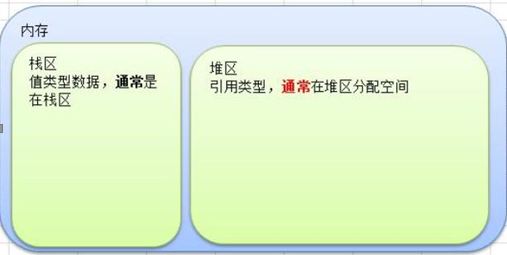

​	3）一般来说，地址拷贝效率高。因为数据小，而值拷贝决定拷贝的数据大小，数据越大，效率越低。

​		如果希望函数内的变量能修改函数外的变量，可以传入地址&,函数内以指针的方式操作变量。

##### 6.10	标识符的命名规范

​		凡是自己可以起名字的地方都叫标识符

- ​		**标识符的命名规则;**

​		1) 由26个英文字母大小写，0-9，_组成。

​		2）数字不可以开头。

​		3）**Golang中严格区分大小写。**

​		4）标识符不能包含空格。

​		5）下划线"_"本省在Go中是一个特殊的标识符，称为空标识符。可以代表任何其他的标识符，但是它对应的值会被忽略。所以仅能被作为占位符使用，不能作为标识符使用。

​		6）不能以系统保留关键字作为标识符（一共25个）

- ​		**标识符命名注意事项：**

​		1）包名：保持package的名字和目录一致，不要和标准库冲突。

​		2）变量名、函数名、常量名:采用驼峰法。

​		3）如果变量名、函数名、常量名首字母大写，则可以被其他的包访问；如果是小写，则只能在本包中使用。

（可以理解成**首字母大写是公开的，首字母小写是私有的**），在Golang中没有public、private等关键字。


​			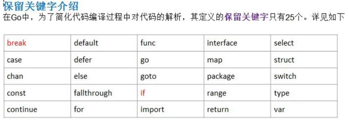


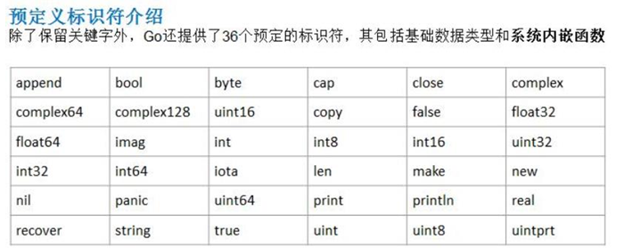


#### 7、Go的运算符

##### 		7.1 算数运算符使用的注意事项

​			1）对于除号"/",它的整数除和小数除是有区别的：

​					**整数之间做除法，只保留整数部分而舍弃小数部分**。例如  想= 19/5，结果为3.

​			2）当一个数取模时，等价于 **a%b = a - a/b*b.**

​			3）Golang的自增自减只能当做一个独立语言使用，不能这样使用。

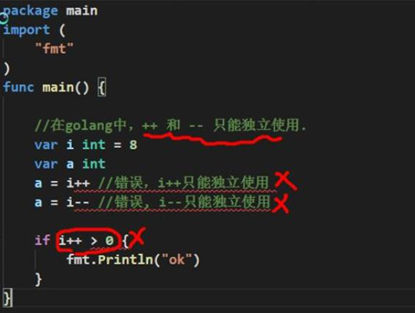

​			4）Golang中的++ 和 --只能写在变量的后面，不能写在变量的前面，即**只有 a++和a-- ，没有++a和--a**。

##### 7.2	逻辑运算符

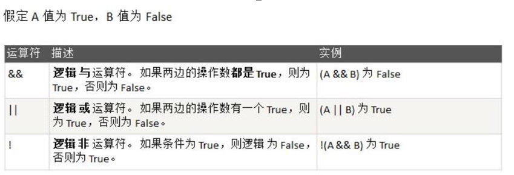


##### 7.3	赋值运算符

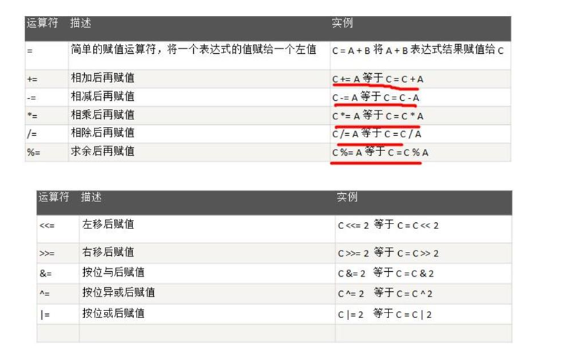


##### 7.4	位运算符

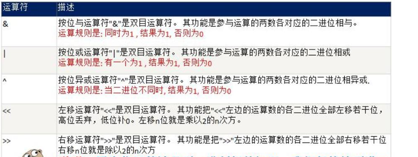


##### 7.5	其他运算符

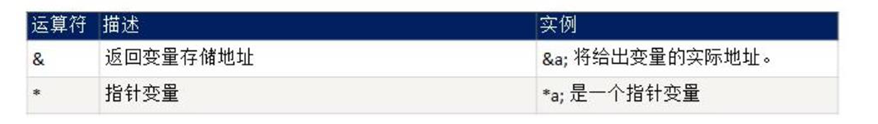

##### 7.6	运算符的优先级

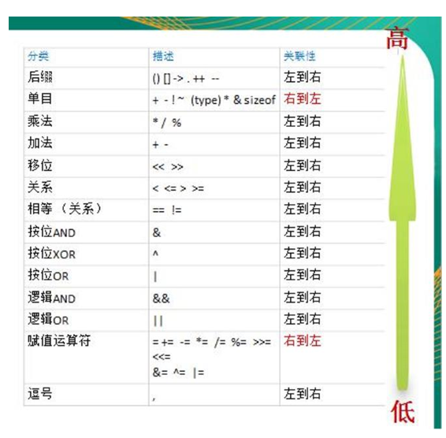

​		**大概的优先级**

1. 括号， ++ ，--
2.  单目运算
3. 算数运算符
4. 移位运算
5. 关系运算符
6. 位运算符
7. 逻辑运算符
8. 赋值运算符
9. 逗号				

##### 7.7 特别说明

**Go中不支持三元运算符**

#### 8 键盘输入语句

方法1

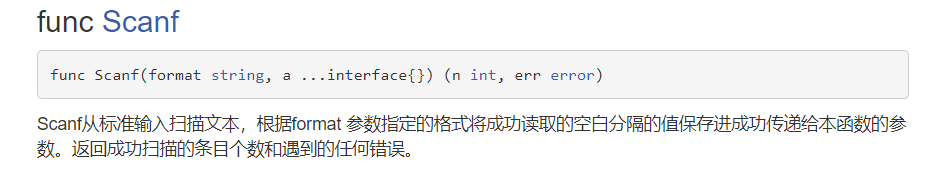

方法2

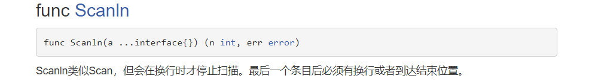


#### 9、 进制转换

##### 		9.1 二进制、八进制和十六进制转十进制

​				**规则**：从最低位开始，将每个位上的数提取出来，乘以2（8或16）的（位数-1）次方，然后求和

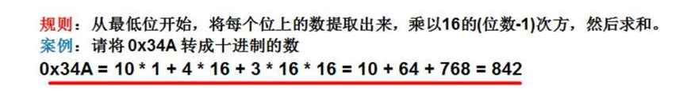

##### 		9.2 十进制转换成其他进制

​				**规则**：将该数不断除以2（8或16），直到商为0为止，然后将每步得到的余数倒过来，就是对应的进制数

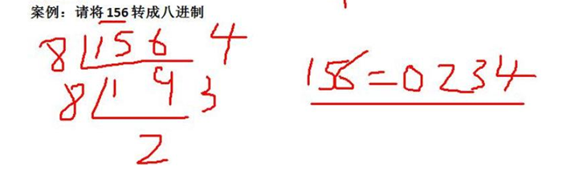


##### 		9.3 二进制转换成八进制和十六进制

​				9.3.1 转成八进制规则：将二进制的每**三**位一组（从低位开始组合），转成对应的八进制即可。

​				案例：将二进制：11010101转成八进制

​				**11010101 = 0325**

​				9.3.2 转成十六进制规则：将二进制的每**四**位一组（从低位开始组合），转成对应的十六进制即可。

​				案例：将二进制：11010101 转成十六进制

​				**11010101 = 0xD5**

##### 		9.4 八进制、十六进制转成二进制

​			 9.4.1 八进制转成二进制规则：将八进制的每一位，转成对应的一个3位的二进制即可。

​			 9.4.2 十六进制转成二进制规则：将十六进制的每一位，转成对应的一个4位的二进制数即可。	

#### 10、位运算	

##### 		10.1 原码、反码、补码

- 二进制的**最高位是符号位**：0表示正数，1表示负数 
- 正数的原码、反码、补码都一样		
- **负数的反码是最高位不变，其他位取反（0->1,1->0）**
- **负数的补码是在反码的基础上加1**
- 0的反码、补码都是0
- 计算机运算的时候都是按**补码**的方式来运算的


##### 	10.2 Go中的位运算

- 按位与**&**：两位都为1，结果为1，否则为0
- 按位或**|**：两位有一位为1，结果为1，否则为0
- 按位异或**^**:两位一个为0，一个为1，结果为1，否则为0


##### 	10.3 Go中的位移运算符

- 右移运算规则**>>** ：符号位不变，低位溢出，并用符号位补溢出的高位
-  左移运算规则**<<**：符号位不变，低位补0


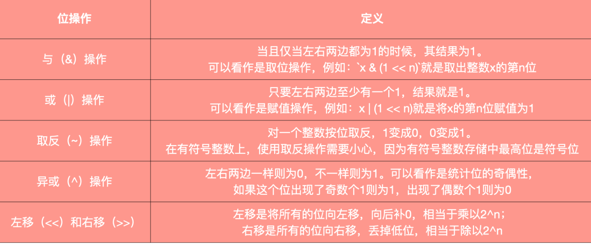


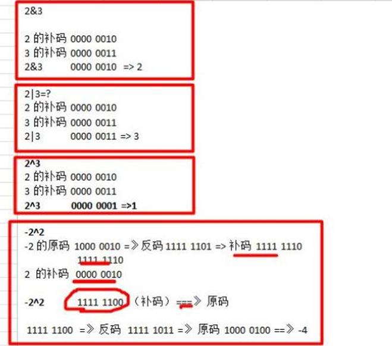


#### 11、Go流程

##### 			11.1 if-else注意事项

```go
package main

import "fmt"

func main() {
   var a int = 100;
 
    //注意事项1： 官方建议把(a < 20)写成 a < 20 ，不带（）
   //注意事项2：{}必须有
   if a < 20 {
       fmt.Printf("a 小于 20\n" );
    //注意事项3：go中条件表达式不能是赋值语句
//   } else if a = 3{  
//       fmt.Printf("a 不小于 20\n" );
    //注意事项4：else}不能换行
   } else {  
       fmt.Printf("a 不小于 20\n" );
   }
   fmt.Printf("a 的值为 : %d\n", a);

}
```

​	

##### 		11.2 switch

​					11.2.1	case/switch后是一个表达式（常量、变量或一个有返回值的函数等）

​					11.2.2	case后的各个表达式的值的数据类型必须和switch的表达式数据类型一致

​					11.2.3	case后面可以带多个表达式，使用逗号间隔

​					11.2.4	case后面的表达式如果是常量，则不能重复

​					11.2.5	**case后面不需要带break**

​					11.2.6	default语句不是必须的

​					11.2.7	switch后也可以不带表达式，类似if-else分支来使用

​					11.2.8	switch后也可以直接声明/定义一个变量，分号结束，不推荐

​					11.2.9	switch穿透（fallthrough），如果在case语句块增加fallthrough，则会继续执行下一个case

​					11.1.10	Type Switch：可以用type-switch判断某个interface变量中实际指向的变量类型

##### 			11.3	switch和if-else的区别

​					11.3.1	如果判断的具体数值不多，而且符合**整数、浮点数、字符、字符串**这几种类型，**使用switct**

​                    11.3.2	对**区间判断和结果为bool类型**的判断使用**if**

##### 			11.4	for循环

​					11.4.1	for{}等价于for;;{}是一个无线循环,通常配合break使用

​					11.4.2	Golang中for-range可以遍历字符串和数组

​					细节：1、如果字符串中有中文，那么传统的遍历字符串方式会出现乱码，原因是传统的字符串的遍历										是按照字节来遍历的，而一个汉字在utf8中对应3个字节，需要将str转成[]rune切片。

​								2、for-range是按照字符方式遍历的，因此如果有中文也不会出现乱码。

##### 			11.5	break

​					11.5.1	break默认会跳出最近的for循环

​					11.5.2	break后面可以指定标签，跳出标签对应的for循环

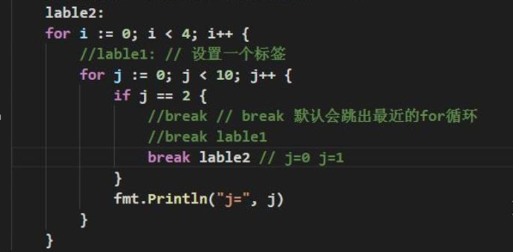


##### 11.6 goto

​		11.6.1	goto通常与条件语句配合使用。可以实现条件转移，跳出循环体等功能。

​		11.6.2	在Go程序中一般不主张使用goto语句，以免造成流程的混乱，使理解和调试程序产生困难。

##### 11.7 return

​		return使用在方法或函数中，表示跳出所在的方法或函数，如果在main函数中表示终止main函数，即终止程序。

​		**Go函数支持返回多个值**，这一点其他编程语言中没有。

```go
func 函数名（形参列表） （返回值类型列表）{
	执行语句
	return 返回值
}
```

​		1）如果返回多个值，在接收时，希望忽略某个返回值，则使用 **_**符号表示占位忽略

​		2）如果返回值只有一个， （返回值类型列表）可以不写（）。


#### 12、包

##### 		12.1 包使用的注意事项

- ​		文件的包名通常和文件所在的文件名一致，一般为小写字母
- ​		在一个文件要使用其它包函数或变量时，需要**先用import引入**，路径从$GOPATH的src下开始。
- ​		为了让其它包的文件可以访问到本包的函数，则函数名的**首字母需要大写**，类似java中的public。
- ​		访问其它包函数、变量的语法是**包名.函数名**。
- ​		如果包名较长，**Go支持给包名取别名**，注意事项，取别名后，原来的包名就不能使用了。
- ​		在同一包下，不能有相同的函数名或全局变量名，否则报重复定义。
- ​		如果需要编译成一个可执行文件，需要将包声明为**main**。


##### 		12.2 函数

​		12.2.1 函数递归需要遵守的重要原则

1. ​	执行一个函数时，就创建一个新的受保护的独立空间（新函数栈）

2. ​	函数的局部变量是独立的，不会相互影响

3. ​	递归必须向退出递归的条件逼近，否则就是无限递归。

4. ​	当一个函数执行完毕，或者遇到return，就返回，遵守谁调用，就将结果返回给谁，同时当函数执行完毕或者返回时，改函数本身也会被系统销毁。

   ​	

​		12.2.2 函数使用的注意事项

1. 函数的形参列表可以是多个，返回值列表也可以是多个。

2. 形参列表和返回值列表的数据类型可以是值类型和引用类型。

3. 函数的命名规范遵循标识符命名规范，首字母不能是数字，首字母大写表示该函数可以被本包文件和其他包文件使用，类似public，首字母小写则只能被本包文件使用，类似private。

4. 函数的变量是局部的，函数外不生效

5. 基本数据类型和数组默认都是值传递的，在函数内修改不会影响到原来的值。

6. 如果希望函数内的变量能修改函数外的变量，可以传入变量的地址&，函数内以指针的方式操作变量。             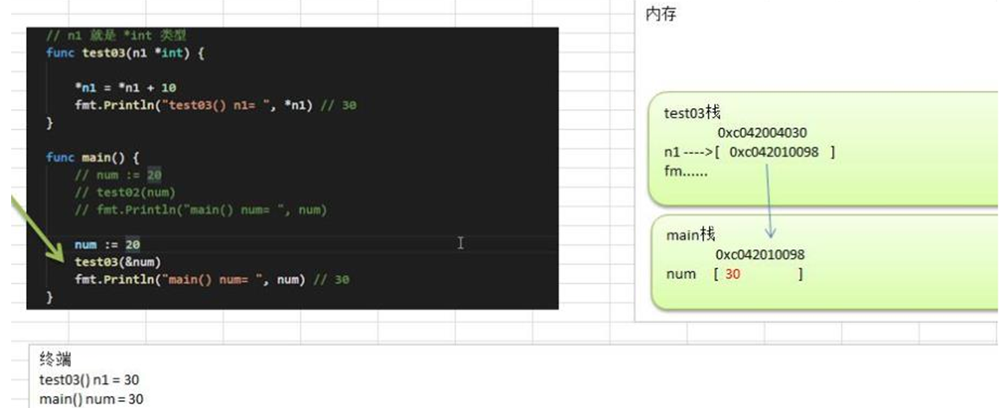

7. Go函数不支持函数重载

8. 在Go中函数也是一种数据类型，可以赋值给一个变量，则该变量就是一个函数类型的变量了，通过该变量 可以对函数进行调用。

9. 函数既然是一种数据类型，因此在Go中，函数可以作为形参，并且调用。

10. 为了简化数据类型定义，Go支持自定义数据类型

    ```
    基本语法：type 自定义数据类型名  数据类型
    ```

11. 支持对函数返回值命名。

12. **使用 _标识符，忽略返回值**

13. **Go支持可变参数**：可变参数需要放到形参列表最后

```go
//支持0到多个参数
func sum(args... int) sum int {

}
//支持1到多个参数
func sum(n1 int,args... int) sum int {

}
```


##### 12.3 init函数

1. ​		每一个源文件都可以包含一个init函数，该函数会在main函数执行前，被Go运行框架调用，即init会在main函数前被调用。
2. ​		如果一个文件同时包含全局变量、init函数和main函数，则执行的流程是**全局变量->init函数->main函数**

##### 12.4 匿名函数

​		Go支持匿名函数，匿名函数就是没有名字的函数，如果我们某个函数只是希望使用一次，可以考虑使用匿名函数，匿名函数也可以实现多次调用。

​		1、在定义匿名函数时就直接调用，这种方式匿名函数只能调用一次

```go
func main(){
	
	res := func(n1 int,n2 int) int {
		return n1 + n2
	}(10,20)
	
	fmt.Println("res = ",res)
}
```

​		2、将匿名函数赋给一个变量（函数变量），再通过该变量来调用匿名函数

```go
func main(){
	a := func(n1 int,n2 int) int{
		return n1 - n2
	}

	res := a(33,22)
	fmt.Println("res = ",res)
}
```

​		3、全局匿名函数：将匿名函数赋给一个全局变量

```go
var (
    Func = func(n1 int ,n2 int) int {
        return n1 * n2
    }
)

func main(){
    res := Func(2,4)
    fmt.Println("res = ",res)
}
```


##### 12.5 闭包

​		闭包允许函数把它的本地变量共享给这个函数内的匿名函数。

​		闭包的说明：

​		1、可以理解成：闭包是类，内部匿名函数是操作。匿名函数和它使用到的共享变量构成闭包。

​		2、调用函数时，共享变量只初始化一次，之后每次调用都是累计调用。

```go
package main

import "fmt"

//闭包
func addClosure() func (int) string {
	var  str  =  "hello"
	return func (n int) string{
		str += string(n)
		return str
	}
}


func main(){
	f := addClosure()
    // ascii码 36->$
	fmt.Println(f(36))  //hello$
	fmt.Println(f(36))	//hello$$
	fmt.Println(f(36))	//hello$$$

}
```


##### 12.6 defer

​		defer的主要价值在于，当函数执行完毕后，可以及时的释放函数创建的资源

​		1、当go执行到一个defer时，不会立即执行defer后的语句，而是将defer后的语句压入到一个栈中，然后继续执行函数的下一个语句。

​		2、当函数执行完后，再从defer栈中，一次从栈顶取出语句执行（**先进后出**）

​		3、在defer将语句放入栈时，也会将相关的值拷贝同时入栈。


执行结果


​		


