# Golang
golang官网 https://golang.google.cn/

golang中文文档  https://studygolang.com/pkgdoc

[Go by Example](https://gobyexample.com/)

[Go 101 电子书](https://go101.org/article/101.html)

#### 1、Golang环境变量配置及其作用:

​	GOROOT:指定  go sdk安装目录

​	Path:指令   sdk\bin目录：

​	GOPATH:就是  golang工作目录：我们的所有项目的源码都这个目录下。

#### 2、Golang程序开发的注意事项：

​		1)  Go源文件以  "go"为扩展名。

​		2)  Go应用程序的执行入口是main()函数。这个是和其它编程语言（比如   java/c）一样。

​		3)  **Go语言严格区分大小写。**

​		4)  Go方法由一条条语句构成，**每个语句后不需要分号**  (Go语言会在每行后自动加分号)，这也体现出 Golang的简洁性。

​		5)  Go编译器是一行行进行编译的，因此我们一行就写一条语句，不能把多条语句写在同一个，否则会报错。

​		6)  go定义的变量，或者import包，必须使用，如果没有使用就会报错。

#### 3、Golang规范的代码风格：

​		1)	Go官方推荐使用行注释来注释整个方法和语句。

​		2)	使用gofmt来进行格式化 。

​		3)	运算符两边习惯性各加一个空格。比如：2  + 4 * 5。

#### 4、Golang程序的编译、运行：

编译：go build源码   = 》生成一个二进制的可执行文件

运行：方法1.对可执行文件运行   xx.exe    ./可执行文件   

​			方法2. go run源码


#### 5、Go变量使用的3种方式

方法1 :指定变量类型，声明后若不赋值，使用默认值

方法2 : 根据值自行判断变量类型（类型推导）

方法3 : 省略var ，注意 :=左边的变量不能是已经声明过的，否则会导致编译错误

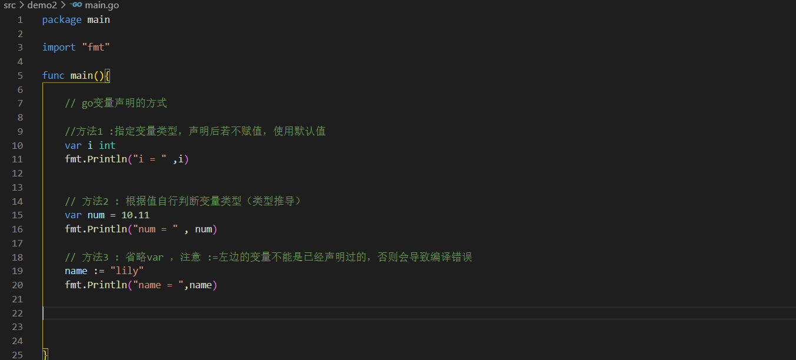

运行结果

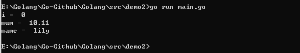


##### 多变量声明

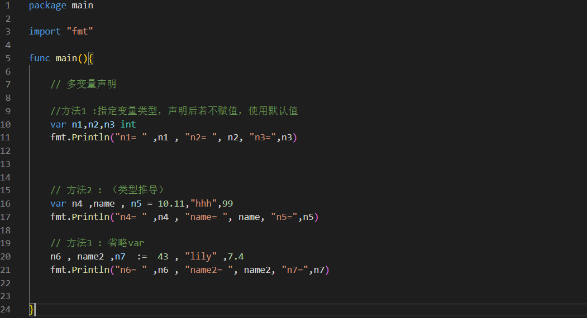

运行结果


##### 一次声明多个全局变量

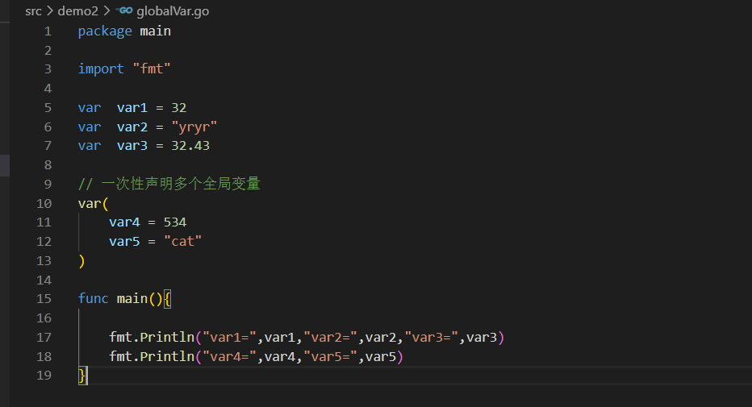

运行结果

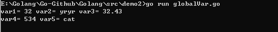


#### 6、Go的数据类型

##### 		6.1 整数类型

**int有符号类型**

| 类型  | 有无符号 | 占用空间 | 表数范围       | 备注 |
| ----- | -------- | -------- | -------------- | ---- |
| int8  | 有       | 1字节    | -128 ~ 127     |      |
| int16 | 有       | 2字节    | -2^15 ~ 2^15-1 |      |
| int32 | 有       | 4字节    | -2^31~ 2^31-1  |      |
| int64 | 有       | 8字节    | -2^63 ~ 2^63-1 |      |

**int无符号类型**

| 类型   | 有无符号 | 占用空间 | 表数范围   | 备注 |
| ------ | -------- | -------- | ---------- | ---- |
| uint8  | 无       | 1字节    | 0 ~ 255    |      |
| uint16 | 无       | 2字节    | 0 ~ 2^16-1 |      |
| uint32 | 无       | 4字节    | 0 ~ 2^32-1 |      |
| uint64 | 无       | 8字节    | 0 ~ 2^64-1 |      |

int的其他类型

| 类型 | 有无符号 | 占用空间    | 表数范围       | 备注                     |
| ---- | -------- | ----------- | -------------- | ------------------------ |
| int  | 有       | 8字节       | -2^63 ~ 2^63-1 |                          |
| uint | 无       | 8字节       | 0 ~ 2^64-1     |                          |
| runc | 有       | 与int32一样 | -2^31 ~ 2^63-1 | 等价int32，编码为Unicode |
| byte | 无       | 与uint8一样 | 0 ~ 255        | 当存储字符时用byte       |

###### 		整型的使用细节

​		1）如何在程序查看某个变量的字节大小和数据类型？

判断数据类型 fmt.Printf

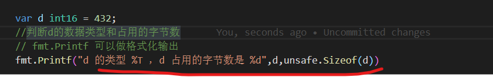

输出结果：

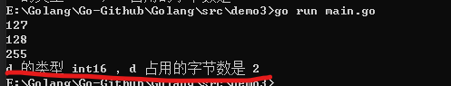

​	2）Golang程序中整型变量在使用时，遵守保小不保大的原则，即：在保证程序正确运行下，尽量   


```go
var age byte = 90
```


##### 6.2 小数类型/浮点型

| 类型          | 占用空间 | 表数范围                 |
| ------------- | -------- | ------------------------ |
| 单精度float32 | 4字节    | -3.403E38  ~ 3.403E38    |
| 双精度float64 | 8字节    | -1.798E3.8  ~  1.798E308 |

​	1)浮点数都是有符号的。

​	2)尾数部分可能丢失，造成精度损失。

​	3)浮点数的存储分为3部分：符号位+指数位+尾数位

######     浮点型使用细节

​	1)Golang浮点类型有固定的范围和字段长度，不受具体OS（操作系统）的影响

​	2)**Golang的浮点数默认声明为float64**

​	3)浮点型常量有两种表示形式

​	4)通常情况下，应该使用float64，因为它比float32更精确。**【开发中推荐使用float64】**

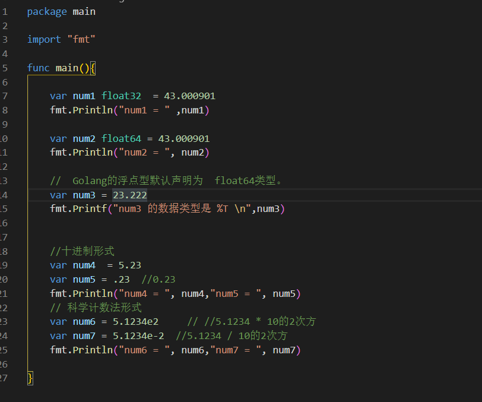

输出结果

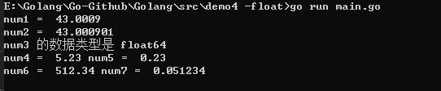


##### 6.3 字符型

​		Golang中没有专门的字符类型，如果要存储单个字符（字母），一般使用**byte**保存。


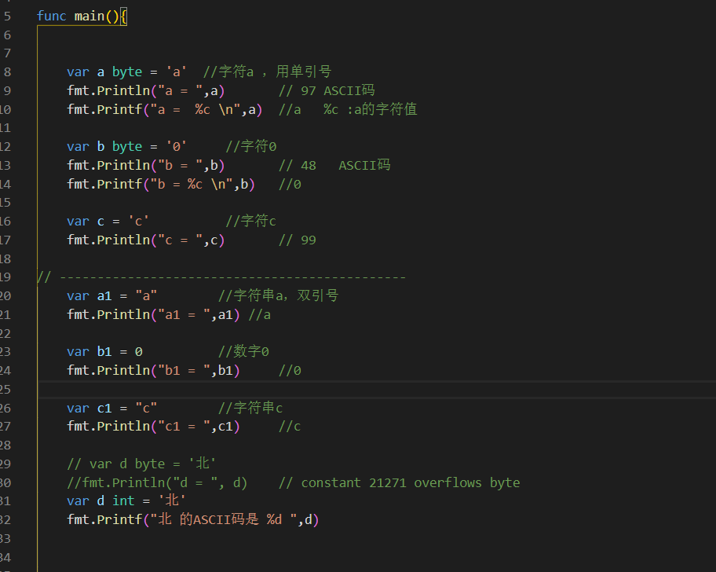


输出结果

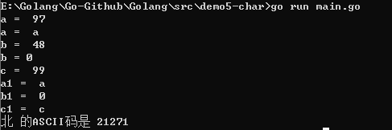

###### 	字符型使用细节

​			1）字符常量用单引号括起来的单个字符。

​						例如：var c1 byte = 'a'

​									var c2 int = '中'

​									var c3 byte = '9'

​			2）Go中使用转义字符 ‘\’来将其后的字符转变为特殊字符型常量。

​			3）Go语言的字符使用UTF-8编码，英文字母1个字节，汉字3个字节。

​					查询UTF-8码值的网址：http://www.mytju.com/classcode/tools/encode_utf8.asp

​			4）fmt.Printf + %c 会输出该数字对应的unicode字符编码：  ,不能用fmt.Println

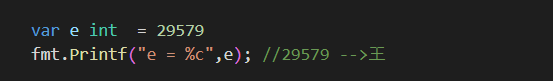

​			5）字符类型时可以运算的，相当于一个整数，因为它都有对应的Unicode码。

###### 字符类型的本质

​	1） 字符类型存储到计算机中，需要将字符对应的码值（整数）找出来。

​				存储： 字符 --> 对应码 -->二进制 -->存储

​				读取：二进制 -->对应码 -->字符	-->读取

​	2）Go语言的编码都统一成UTF-8 。非常方便，再也没有乱码的困扰了。

##### 6.4 布尔类型

​		1）bool类型数据只允许取值   true和   false。

​		2)  bool类型占 1个字节。

##### 6.5 字符串类型

​		1)  Go语言的字符串的字节使用 UTF-8编码标识，不会出现中文乱码问题。

​		2)    字符串的两种表示形式

​				(1)双引号,会识别转义字符   

​				(2)反引号，以字符串的原生形式输出，包括换行和特殊字符，**可以实现防止攻击、输出源代码**等效果.

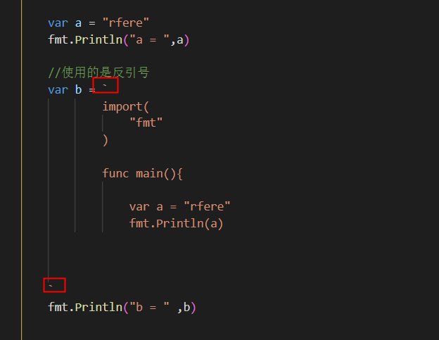

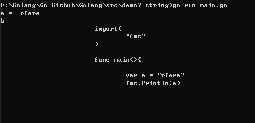

​		3)当一行字符串太长时，需要使用到多行字符串，可以用 + 拼接，但是 + 要留在上一行

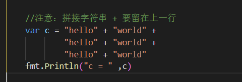


##### 6.6 基本数据类型的转换

###### 		Go中数据类型不能自动转换，需要显示转换


输出结果：无法自动转换


**显示转换后**

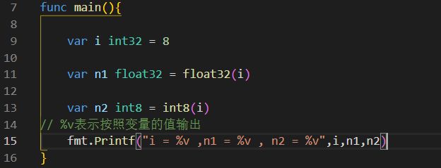

输出结果

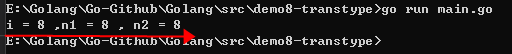


###### 注意事项

```shell
在转换中，比如将int64转成int8【-128---127 】，编译时不会报错，
只是转换的结果是按溢出处理，和我们希望的结果不一样。
因此在转换时，需要考虑范围.
```


##### 6.7 基本数据类型和string的转换

```go

package main

import "fmt"

func main(){

	var num1 int32 = 456

	var num2  float32  = 43.1

	var b1 bool = false

	var b2 byte = 'f'

	var str string

	// 基本数据类型转换成string 方法1：使用fmt.Sprintf
	str = fmt.Sprintf("%d",num1)
	fmt.Printf("str type %T str=%q\n",str,str)	//str type string str="456"

	str = fmt.Sprintf("%f",num2)
	fmt.Printf("str type %T str=%q\n",str,str)	//str type string str="43.099998"

	str = fmt.Sprintf("%t",b1)
	fmt.Printf("str type %T str=%q\n",str,str)	//str type string str="false"

	str = fmt.Sprintf("%c",b2)
	fmt.Printf("str type %T str=%q\n",str,str)	//str type string str="f"

    
    
    // 基本数据类型转换成string 方法2：使用strconv包
	str = strconv.FormatInt(int64(num1),10)
	fmt.Printf("str type %T str=%q\n",str,str)	//

	// 5表示小数位数，64 表示float64
	str = strconv.FormatFloat(num2,'f',5,64)
	fmt.Printf("str type %T str=%q\n",str,str)	//

	str = strconv.FormatBool(b1)
	fmt.Printf("str type %T str=%q\n",str,str)	//

	str = strconv.FormatByte(b2)
	fmt.Printf("str type %T str=%q\n",str,str)	//

}

```

**格式化参数**

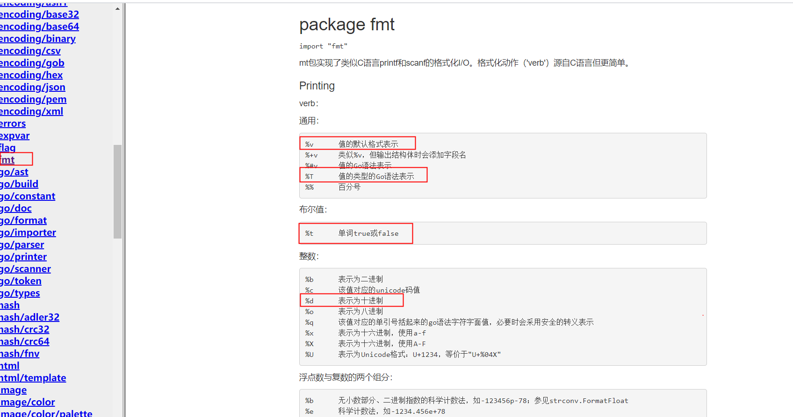


**string转基本数据类型**

```go
func main() {

		var str string = "true"

		var b bool = true

		b,_ = strconv.ParseBool(str)
		fmt.Printf("b type %T , b=%v\n",b,b)	//b type bool , b=true

}

```

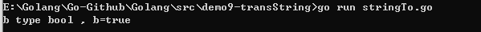